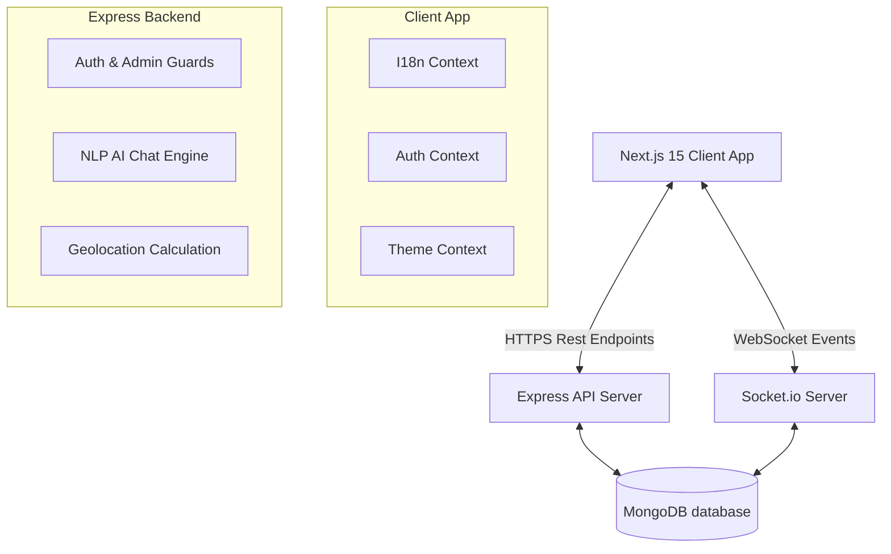

# System Architecture - FixMate AI

FixMate AI is built on a modular full-stack architecture decoupling the interactive frontend and backend service layers.

## High-Level Architecture Diagram

## Folder Layout Map
*   `client/`: React/Next.js 15 app router application.
    *   `src/app/`: Core route pages (landing, login, bookings, dashboards).
    *   `src/components/`: Modular UI units (Floating Chatbot, Sticky Navbar, Footer).
    *   `src/context/`: Context engines (Auth, Theme, I18n translation, WebSockets).
*   `server/`: Express backend API.
    *   `config/`: Connection bindings.
    *   `models/`: Database collections (Mongoose Schemas).
    *   `routes/`: Controllers handling users, professionals query, bookings flow, and AI chat parser.
    *   `data/`: Seeding configurations.

## Critical Mechanics

### 1. Geolocation & Haversine Sorting
When a user searches for professionals or triggers Emergency Mode:
1. The client retrieves coordinates via standard browser geolocation.
2. The coordinates (`lat`, `lng`) are dispatched to `GET /api/professionals`.
3. The server runs the Haversine formula to compute distance offsets:
   $$d = 2R \arcsin\left(\sqrt{\sin^2\left(\frac{\Delta \phi}{2}\right) + \cos(\phi_1)\cos(\phi_2)\sin^2\left(\frac{\Delta \lambda}{2}\right)}\right)$$
4. Workers are ordered by proximity. If Smart AI Recommendation is flagged, the server assigns a score:
   $$\text{Score} = (0.6 \times \text{Rating}) + \left(0.4 \times \frac{10}{d + 1}\right)$$
   and ranks by highest score.

### 2. Real-time Status Sync Loop
1. User schedules an appointment.
2. Server registers booking and emits a Socket event `booking_created` to the administrators.
3. Administrator updates state (Accepted or Completed).
4. Server registers DB update and broadcasts `booking_updated` to the room of the user ID.
5. Client captures the notification on SocketContext and fires a real-time notice banner.
