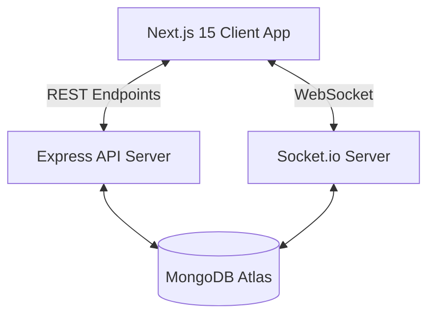

# FixMate AI 🛠️🤖
### *Find Trusted Local Service Professionals Instantly*

[](https://nextjs.org/)
[](https://react.dev/)
[](https://nodejs.org/)
[](https://www.mongodb.com/)
[](file:///d:/open%20source%20hackathon/LICENSE)
[](https://github.com/Muddassirsayyed/Open-Source-Hackathon-Elite-Coders-)
[](https://client-nine-nu-66.vercel.app)

FixMate AI is a production-ready, full-stack web application designed for hackathons, helping users discover, track, and book verified service professionals (plumbers, electricians, mechanics, and technicians) in their immediate neighborhood.

---

## 🌐 Live Hosted Demo

The application is deployed live and can be accessed at:
👉 **[https://client-nine-nu-66.vercel.app](https://client-nine-nu-66.vercel.app)**

---

## 🌟 Core Features

*   **📍 Live Radar Location Mapping**: Interactive mapping visual interface using GPS coordinates and the Haversine calculation to detect professionals in the user's proximity sector.
*   **🚨 Emergency Service Mode**: A rapid-response matching module. Generates 30-minute dispatches for critical issues, automatically assigning the nearest available professional to the user's coordinates.
*   **🤖 Interactive AI Chatbot**: Conversational agent powered by an NLP query matcher. Explains services, retrieves active pricing, recommends the highest-rated workers, and initiates bookings directly from chat.
*   **🌐 Multi-Language Localization**: Instant client-side dictionary state translations supporting **English**, **Hindi (हिन्दी)**, and **Marathi (मराठी)**.
*   **⚡ Real-time Updates via WebSockets**: Full Socket.io integration to sync dashboards, showing notifications instantly when a booking is accepted or completed.
*   **📱 Progressive Web App (PWA) Support**: Installable application layout containing manifests and custom service workers.
*   **📊 Unified Dashboard**: Contextual panels for Users (manage profile, booking logs, notification history) and Admins (system diagnostics, booking status actions, directory registration).

---

## 🏗️ Technical Architecture


Detailed mechanics are documented in [ARCHITECTURE.md](file:///d:/open%20source%20hackathon/ARCHITECTURE.md).

---

## 🛠️ Tech Stack
*   **Frontend**: Next.js 15 (App Router), React, TypeScript, Tailwind CSS, Framer Motion, Lucide Icons.
*   **Backend**: Node.js, Express.js, Socket.io, Mongoose (MongoDB).
*   **Securities**: JWT (JSON Web Tokens), bcryptjs hashing middleware.
*   **PWA**: Web App Manifest, Service Workers.

---

## 📁 Repository Structure
```
FixMate-AI/
├── .github/
│   └── workflows/          # GitHub Actions CI check
├── docs/
│   └── demo-video-link.md  # Presentation walkthrough references
├── client/                 # Next.js 15 app router project
│   ├── src/app/            # Route pages
│   ├── src/components/     # UI elements (Navbar, Footer, Chatbot)
│   └── src/context/        # Global context models (Auth, Socket, I18n)
├── server/                 # Express REST & Socket.io server
│   ├── config/             # DB settings
│   ├── models/             # Mongoose Schemas (User, Professional, Booking)
│   ├── routes/             # API routing
│   └── data/               # Seed data script
└── README.md
```

---

## 🚀 Quick Start & Installation

### 1. Clone the repository
```bash
git clone https://github.com/Muddassirsayyed/Open-Source-Hackathon-Elite-Coders-.git
cd Open-Source-Hackathon-Elite-Coders-
```

### 2. Setup Database & Start Server
```bash
cd server
npm install
# Seed mock database values (Users, Professionals, Services)
npm run seed
# Start API daemon
npm run start
```
*Backend runs on [http://localhost:5000](http://localhost:5000)*

### 3. Start Frontend Client
```bash
cd ../client
npm install
npm run dev
```
*Frontend interface loads on [http://localhost:3000](http://localhost:3000)*

---

## 🧪 Demo Credentials
Once the database is seeded, use the following test accounts:
*   **Admin Access**:
    *   *Email*: `admin@fixmate.com`
    *   *Password*: `admin123`
*   **User Access**:
    *   *Email*: `john@gmail.com`
    *   *Password*: `user123`

---

## 🔮 Future Roadmap
1.  **Payment Gateway Integration**: Direct transaction processing using Stripe or Razorpay.
2.  **Live GPS Geofencing**: Real-time map navigation showing the technician walking/driving towards the booking address.
3.  **Video Consultation**: Remote diagnostics chatbot enabling visual troubleshooting.

---

## 👥 Contributors
*   **Team Elite Coders** - *Muddassir Sayyed (Lead Developer)*

---

## 📄 License
This project is licensed under the MIT License. See [LICENSE](file:///d:/open%20source%20hackathon/LICENSE) for more details.
