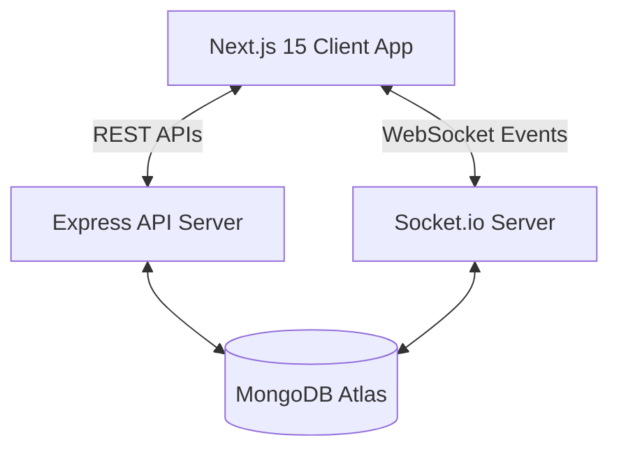

# FixMate AI 🛠️🤖
### *Find Trusted Service Professionals Near You*

[](https://nextjs.org/)
[](https://react.dev/)
[](https://nodejs.org/)
[](https://www.mongodb.com/)
[](file:///d:/open%20source%20hackathon/LICENSE)
[](https://client-nine-nu-66.vercel.app)

FixMate AI is a complete, full-stack, production-ready web application that helps users find and book verified local service professionals (plumbers, electricians, mechanics, painters, and tech support) in their immediate neighborhood.

---

## 🌐 Live Deployment
*   **Vercel Hosted Link**: 👉 **[https://client-nine-nu-66.vercel.app](https://client-nine-nu-66.vercel.app)**
*   **GitHub Repository**: [https://github.com/Muddassirsayyed/Open-Source-Hackathon-Elite-Coders-](https://github.com/Muddassirsayyed/Open-Source-Hackathon-Elite-Coders-)

---

## 🌟 Core Features

*   **📍 Proximity Radar Map**: Interactive location mapping view using the browser's GPS coordinates and the **Haversine formula** to calculate distances and pinpoint active nearby workers on a circular grid.
*   **🚨 Emergency Service Mode**: A rapid-response system. Click the pulse button to trigger a 30-minute dispatch, automatically assigning the closest active worker to your coordinates.
*   **🤖 Conversational AI Assistant**: Floating chatbot panel running on a smart keyword-NLP engine. Guides users, displays pricing charts, recommends professionals, and initiates bookings directly in chat.
*   **🌐 Multi-Language Support**: Complete dictionary state translations for **English**, **Hindi (हिन्दी)**, and **Marathi (मराठी)**.
*   **⚡ WebSocket Real-time Status Sync**: Push notification bridge using Socket.io to sync user and admin dashboards instantly when bookings are accepted, completed, or cancelled.
*   **📊 Unified Portals**: Dynamic portal access changing between the User Panel (bookings trackers, coordination center) and the Admin Panel (user logs, worker creators, status modifiers).
*   **📱 PWA Support**: Manifest config file for mobile app layout installations.

---

## 🏗️ Technical Architecture



---

## 🛠️ Tech Stack
*   **Frontend**: Next.js 15 (App Router), React, TypeScript, Tailwind CSS, Framer Motion, Lucide Icons.
*   **Backend**: Node.js, Express.js, Socket.io, Mongoose (MongoDB).
*   **Security**: JWT (JSON Web Tokens), bcryptjs password hashing.
*   **PWA**: Web App Manifest, Service Workers.

---

## 🚀 Local Installation Guide

### 1. Clone & Set Up Directory
```bash
git clone https://github.com/Muddassirsayyed/Open-Source-Hackathon-Elite-Coders-.git
cd Open-Source-Hackathon-Elite-Coders-
```

### 2. Configure & Start Express Backend
```bash
cd server
npm install
# Seed mock database values (Users, Professionals, Services)
npm run seed
# Start backend API (runs on port 5005)
npm start
```

### 3. Configure & Start Frontend Client
```bash
cd ../client
npm install
# Start Next.js client (runs on port 3000)
npm run dev
```

---

## 🧪 Seeding & Test Credentials
The database seed script automatically creates mock professionals distributed around Mumbai sectors. Log in using these credentials:
*   **Admin Dashboard**:
    *   *Email*: `admin@fixmate.com`
    *   *Password*: `admin123`
*   **User Dashboard**:
    *   *Email*: `john@gmail.com`
    *   *Password*: `user123`

---
Participant Name : Muddassir Mushtaque Sayyed

Team Name : Elite Coder's

Project Title : FixMate AI
Smart Local Service Finder with AI Assistance

Project Description : FixMate AI is a modern full-stack web platform that connects users with trusted nearby service professionals such as plumbers, electricians, mechanics, carpenters, AC repair technicians, and more. The platform features secure authentication, location-based service discovery, real-time booking, an AI-powered chatbot, and a user-friendly interface to make finding and hiring local professionals fast, simple, and reliable.

## 📄 License
Licensed under the MIT License. See [LICENSE](file:///d:/open%20source%20hackathon/LICENSE) for terms.
