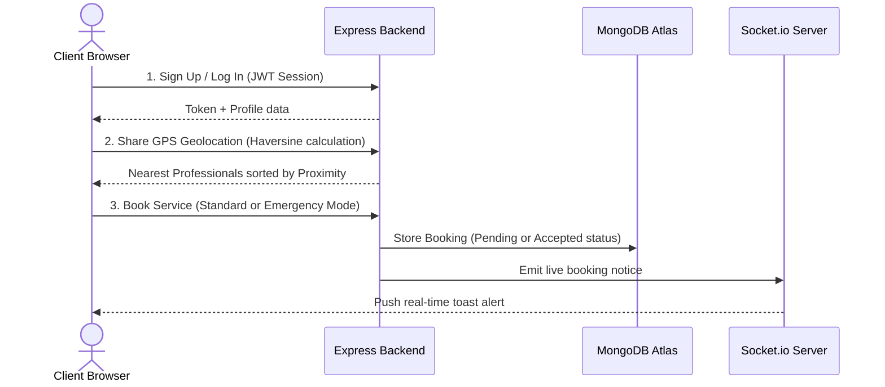

# FixMate AI - Application Workflow

This document describes the step-by-step operational and technical workflow of the **FixMate AI** platform, explaining how users, professionals, the backend API, and real-time triggers interact.

---

## 🔄 User Journey & Technical Workflow

---

## 📍 Step-by-Step Breakdown

### Step 1: User Onboarding & Location Setup
1.  **Authentication**: Users sign up or log in. Sessions are secured using JSON Web Tokens (JWT) saved in client-side persistence.
2.  **Geolocation Tracking**: 
    *   The client app requests browser GPS coordinates.
    *   Once authorized, coordinates are synced to the backend database via `PUT /api/auth/location` to set the active search center.

### Step 2: Discovering Local Professionals
1.  **Service Selection**: Users browse the **Services** catalog covering 10 categories (Plumbing, Electrical, AC repair, etc.).
2.  **Radar Mapping Search**:
    *   The app sends coordinates to `GET /api/professionals`.
    *   The backend calculates distances in kilometers using the **Haversine formula**.
    *   Proximity positions are mapped visually onto a circular **Live Radar Grid**.
3.  **Smart AI Recommendation**: If enabled, the system ranks professionals using a weighted scoring algorithm:
    $$\text{Score} = (0.6 \times \text{Rating}) + \left(0.4 \times \frac{10}{\text{Distance} + 1}\right)$$

### Step 3: Booking Appointments

*   **Option A: Standard Scheduling**
    1.  User views the professional's profile and chooses a custom **Date** and **Time Slot**.
    2.  User describes the issue and clicks **Confirm Booking**.
    3.  The booking is logged as `Pending` awaiting worker acceptance.
*   **Option B: Emergency Mode (30-Minute Dispatch)**
    1.  User clicks the flashing **Emergency Mode** CTA.
    2.  The backend automatically queries all active, online workers in the requested category.
    3.  The closest worker is calculated and assigned immediately.
    4.  Booking status is set directly to `Accepted` to trigger immediate dispatch.

### Step 4: Real-time Status Sync & WebSockets
1.  On login, users join a unique WebSocket room matching their `UserId`.
2.  When an administrator or professional accepts, completes, or cancels a booking, the backend emits `booking_updated` to the socket room.
3.  The client-side `SocketContext` registers the trigger and renders an instant desktop notification toast.

### Step 5: Service Completion & Feedback Loop
1.  Once the issue is fixed, status transitions to `Completed`.
2.  The user is prompted to submit a **Review** (1-5 star rating and comment).
3.  A MongoDB post-save hook automatically aggregates all reviews for that professional, updating their average rating and total review counts in the directory.
